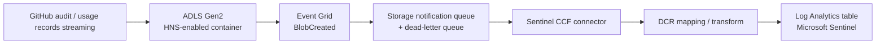

# GitHub Copilot Audit Sentinel

面向安全团队的 GitHub Enterprise / GitHub Copilot 审计日志采集、完整留存和
Microsoft Sentinel 分析方案。

> **当前状态：已部署并完成端到端验证（Deployed）**
>
> Azure 环境 `audit-sentinel-a8f2` 已部署到订阅
> `3456866f-6478-471f-8d59-a29a335d797a`、资源组 `aks-test`、区域
> `West US 2`。合成测试已验证 Event Grid 投递、Function 托管身份读取 Blob、
> Logs Ingestion API 返回 204，以及完整原始记录在 Log Analytics 中可查询。

## 1. 项目目标

本项目把 GitHub Enterprise 持续写入 Azure Blob Storage 的审计日志送入一个专用
Log Analytics 工作区和 Microsoft Sentinel。设计同时满足两类需求：

1. **调查完整性**：默认不脱敏、不裁剪字段，尽可能完整保留原始记录。
2. **查询效率**：提取常用规范化字段，供 KQL、Workbook 和检测规则快速筛选。

系统使用 AZD + Bicep 管理基础设施，使用 Python 3.12 Azure Functions v2 编程模型，
全链路通过 Microsoft Entra ID 和托管身份授权，不在代码或应用设置中保存存储密钥、
SAS、PAT、客户端密码或 Log Analytics 共享密钥。

> [!CAUTION]
> `GitHubCopilotAudit_CL.RawEvent` 可能包含完整 `Authorization`、HTTP headers、
> prompts、源代码、模型输出、工具参数、个人信息、IP 地址以及设备/会话标识。
> 必须把工作区、表、查询结果、导出和 Workbook 权限限制给获批的安全调查人员，
> 并采用满足调查要求的最短保留期。

## 2. 最终架构

[](docs/assets/github-copilot-audit-sentinel.png)

> 动态预览展示通知、读取、处理和 ingestion 链路。也可查看
> [静态 PNG](docs/assets/github-copilot-audit-sentinel.png) 或下载
> [可编辑 Excalidraw 源文件](docs/assets/github-copilot-audit-sentinel.excalidraw)。

> [!IMPORTANT]
> Event Grid **只传递 `BlobCreated` 事件元数据和 Blob reference，不搬运 Blob
> 内容**。Function 收到原生 `EventGridTrigger` 通知并完成严格来源验证后，才使用系统
> 托管身份通过 `BlobClient` 主动读取 Blob bytes。内容随后由 Function 调用 Logs
> Ingestion API，DCR 将其路由到 Log Analytics；Microsoft Sentinel 是启用在该
> Workspace 上的 SIEM 层。

```mermaid
flowchart LR
    GHE["GitHub Enterprise<br/>Audit log streaming"]
    BLOB["Existing Blob source<br/>ypycopilottest/<br/>github-copilot-audit-log"]
    TOPIC["Existing Event Grid System Topic<br/>ypycopilottest-6a08b4cd-<br/>1cb5-4b03-af5d-5cc1ae92f536"]
    DEFENDER["Existing Defender subscription<br/>StorageAntimalwareSubscription"]
    SUB["Audit Event Subscription<br/>egsub-copilot-audit-fgymbaw6iea7<br/>BlobCreated + prefix + suffix"]

    subgraph FUNC["Azure Function · Flex Consumption · Python 3.12"]
        TRIGGER["Native EventGridTrigger<br/>process_blob_upload"]
        VALIDATE["Strict source validation<br/>type · topic · HTTPS host<br/>container · subject · suffix"]
        DOWNLOAD["BlobClient download<br/>DefaultAzureCredential<br/>system-assigned MI"]
        PARSE["In-memory parser<br/>gzip or plain bytes<br/>object · array · JSONL"]
        TRANSFORM["Raw transform hook<br/>identity / no-op by default"]
        NORMALIZE["Normalized metadata<br/>+ complete RawEvent chunks"]
    end

    API["Azure Monitor<br/>Logs Ingestion API"]
    DCR["Direct DCR<br/>dcr-copilot-audit-fgymbaw6iea7"]
    TABLE["Log Analytics<br/>GitHubCopilotAudit_CL"]
    SENTINEL["Microsoft Sentinel<br/>Workbook + KQL"]

    GHE -- "writes compressed audit blobs" --> BLOB
    BLOB -- "BlobCreated metadata only" --> TOPIC
    TOPIC --> DEFENDER
    TOPIC --> SUB
    SUB -- "native AzureFunction notification" --> TRIGGER
    TRIGGER --> VALIDATE --> DOWNLOAD --> PARSE --> TRANSFORM --> NORMALIZE
    BLOB -. "MI reads blob bytes" .-> DOWNLOAD
    NORMALIZE --> API --> DCR --> TABLE --> SENTINEL
```



### 2.1 组件和数据流

| 步骤 | 组件 | 行为 |
|---|---|---|
| 1 | GitHub Enterprise | 将企业审计日志流式写入既有 Blob 容器 |
| 2 | Blob Storage | 源为 `ypycopilottest/github-copilot-audit-log` |
| 3 | Event Grid System Topic | 发布存储账户产生的 `BlobCreated` 元数据通知；不承载 Blob bytes；由审计订阅和 Defender 订阅共享 |
| 4 | Event Subscription | 只选择目标容器内以 `.json.log.gz` 结尾的 `BlobCreated`，并通知原生 Azure Function endpoint |
| 5 | `process_blob_upload` | 原生 Python v2 `EventGridTrigger`，而不是 BlobTrigger |
| 6 | 来源验证 | 校验事件类型、topic 资源 ID、HTTPS hostname、容器、subject、URL 和后缀 |
| 7 | Blob 下载 | 仅在验证通过后，由 Function 使用系统托管身份主动下载目标 Blob；Event Grid 不参与内容传输 |
| 8 | 解析 | 在内存中处理 gzip 或普通字节、JSON object、array、JSON Lines |
| 9 | 转换与规范化 | 默认完整保留原文，同时派生常用元数据列 |
| 10 | 分块与批处理 | 大记录按 UTF-8 安全边界分块；上传批次有记录数和字节数上限 |
| 11 | Logs Ingestion + Direct DCR | Function 使用托管身份调用 Logs Ingestion API；DCR 做最终类型投影并路由到 Log Analytics |
| 12 | Log Analytics + Sentinel | 数据存储在 Workspace 的 `GitHubCopilotAudit_CL`；Sentinel 基于该 Workspace 运行 Workbook、hunting 和 analytics KQL |

从网络和职责上看，这是三条相互关联但不同的路径：

1. **写入路径**：GitHub Enterprise → source Blob。
2. **通知与读取路径**：Blob `BlobCreated` metadata → Event Grid → native
   `EventGridTrigger`；Function MI → Blob GET。
3. **分析路径**：Function → Logs Ingestion API → Direct DCR → Log Analytics
   Workspace → Sentinel。

### 2.2 Sentinel、Log Analytics、DCR 与 Function 的职责边界

Microsoft Sentinel 不是另一份日志存储。它是启用在专用 Log Analytics Workspace（LAW）
`log-copilotauditfgymbaw6iea7g` 上的 SIEM 能力层；数据实际存放在该 workspace 的
`GitHubCopilotAudit_CL` 表中。Sentinel analytics、hunting、Workbook 和日常 KQL
读取的都是这张表，表级 RBAC、retention 和计费也由 LAW/Sentinel 数据层控制。

**Azure Function 负责内容语义和传输：**

1. 验证 Event Grid 事件只引用获批 storage account、container 和 suffix。
2. 使用系统托管身份下载 Blob。
3. 处理 gzip/plain、object/array/JSONL、nested `body`、malformed/binary 等变体。
4. 执行默认 no-op 的 raw transform，派生规范化字段，并在 UTF-8 安全边界分块。
5. 以最多 500 rows、750,000 bytes 的请求批次调用 Logs Ingestion API；单 row
   仍超限时显式失败，不静默截断。

**Direct DCR 负责 Azure Monitor 的写入契约和路由：**

- 输入 stream 是 `Custom-GitHubCopilotAudit_CL`。
- `streamDeclarations` 声明第 11 节列出的 21 个字段及其 Azure Monitor 类型。
- `dataFlows.transformKql` 从 `source` 显式 `project` 全部字段，并用
  `tostring`、`toint`、`tolong`、`todatetime` 做最终类型投影；它不删除 raw 字段。
- `destinations.logAnalytics` 指向上述 LAW，`outputStream` 仍为
  `Custom-GitHubCopilotAudit_CL`，因此输出进入 `GitHubCopilotAudit_CL`。
- 当前 DCR 使用 `2024-03-11` Direct 模式并提供自己的 public Logs Ingestion
  endpoint；只有未来采用 Private Link 时才需要额外 DCE。

Logs Ingestion API 不能“绕过 DCR 直接写表”。每次调用都必须携带 DCR immutable ID
和 stream name；DCR 告诉 Azure Monitor 输入 JSON 的结构、允许的转换以及目标
workspace/table。Function 决定“事件是什么、如何保真”，DCR 决定“Azure Monitor
如何接收、类型化并路由”。修改表 schema 时必须同步修改 Function 输出、DCR
`streamDeclarations`、`transformKql` 和目标表，不能只改其中一层。

## 3. System Topic 与 Event Subscription

**System Topic（系统主题）**代表 Azure 服务本身的事件源。本项目的事件源是存储账户
`ypycopilottest`。Azure Storage 对同一 source 只允许一个 tracked system topic，
因此不能为审计流水线再创建第二个主题。

本环境复用既有主题：

```text
ypycopilottest-6a08b4cd-1cb5-4b03-af5d-5cc1ae92f536
```

该主题上原有的 `StorageAntimalwareSubscription` 属于 Defender。项目不会更新、替换或
删除它。

**Event Subscription（事件订阅）**是主题上的独立路由规则。审计流水线只管理：

```text
egsub-copilot-audit-fgymbaw6iea7
```

其最终配置为：

| 配置 | 值 |
|---|---|
| Destination type | `AzureFunction` |
| Function | `func-fgymbaw6iea7g/functions/process_blob_upload` |
| Included event type | `Microsoft.Storage.BlobCreated` |
| Subject begins with | `/blobServices/default/containers/github-copilot-audit-log/blobs/` |
| Subject ends with | `.json.log.gz` |

Event Grid 过滤用于减少无关调用；Function 内部仍执行同样严格的来源验证，防止任意
URL、其他账户、其他容器、带 query/SAS 的 URL 或 subject/URL 不一致事件触发下载。

## 4. 完整数据保留契约

### 4.1 默认不脱敏

`src/copilot_audit/transform.py` 中的默认策略是 `identity`：

```text
RAW_TRANSFORM_POLICY=identity
```

它不会选择、删除、遮盖或截断任何源字段。包括未知/新增字段在内的完整外层记录都进入
`RawEvent`。规范化列只用于检索，不替代原始审计证据。

### 4.2 支持的输入与异常数据

| 输入 | 保留方式 |
|---|---|
| JSON object | 保留完整解码文本，包括原始空白 |
| JSON array | 每个元素保留自己的原始 JSON token 和稳定索引 |
| JSON Lines | 每个非空物理行独立保留；索引对应原始行号 |
| `body` 是 JSON 字符串 | 解析用于派生元数据，原始外层记录仍完整保留 |
| `body` 无法解析 | 原始外层记录仍保留，`ParseStatus` 标识状态 |
| malformed JSONL | 保留原始行文本并标记 `invalid_json` |
| 非 UTF-8 字节 | Base64 写入 `RawEvent`，`RawEncoding` 标识编码 |
| 损坏的 gzip | 保留压缩字节的 Base64，标记 `invalid_gzip` |
| 单 Blob 超过 64 MiB | 显式记录 `not-captured:blob_too_large`，不静默截断 |
| 解压后超过 64 MiB | 显式记录 `not-captured:decompressed_payload_too_large` |

### 4.3 原始内容分块

单条原始记录大于 64,000 UTF-8 bytes 时会安全分块，不会切断 UTF-8 code point：

- `RawEvent`：当前原始内容分块。
- `RawEncoding`：例如 `utf-8-json`、`gzip+utf-8-jsonl-record`、`base64`。
- `RawContentHash`：分块前完整转换内容及编码的 SHA-256 版本标识。
- `RawChunkIndex`：从 0 开始的分块序号。
- `RawChunkCount`：该记录的总分块数。

实现位于 `src/copilot_audit/normalizer.py`。算法不是按 Python 字符数切割：先将完整
transform 输出字符串编码成 UTF-8，再以最多 64,000 bytes 取块；如果边界落入多字节
code point，边界向前回退到可解码位置。这样每个 `RawEvent` chunk 都是有效字符串，
同时避免 Azure Monitor 单列/请求尺寸风险。

两个确定性标识的准确输入如下：

```text
EventId =
  SHA256(UTF8(SourceBlob + "\n" + SourceRecordIndex)).hexdigest()

RawContentHash =
  SHA256(UTF8(RawEncoding + "\0" + CompleteTransformedContent)).hexdigest()
```

因此 `RawContentHash` 不是对某个 chunk 单独计算，也不只是对 JSON 内容计算；编码标签和
NUL 分隔符是哈希输入的一部分。同一 source record 的所有 chunks 共享 `EventId`、
`RawContentHash` 和 `RawChunkCount`，只有 `RawChunkIndex` 不同。

### 4.4 完整性、日常查询与至少一次投递

Event Grid 和 Logs Ingestion 是至少一次处理语义，同一逻辑事件可能产生重复物理 rows。
本实现没有在写入路径做状态型去重，以免状态故障造成证据丢失。规范如下：

- 物理 chunk 去重键：`(EventId, RawContentHash, RawChunkIndex)`。
- 日常只看规范化字段时先过滤 `RawChunkIndex == 0`，再按 `EventId` 取最新
  `IngestedAt`；这只表示“事件出现过”，不证明 raw chunks 完整。
- 完整性检查必须先按物理 chunk 去重，再比较实际索引集合和
  `range(0, RawChunkCount - 1)`。只比较 `count()` 或 `dcount()` 可能把
  `{0, 2}` 错当成一个应有两块的完整版本。
- 同一 `EventId` 如出现多个 `RawContentHash`，选择最新的**完整**内容版本，而不是把
  不同版本的 chunks 混合。
- 重组时按 `RawChunkIndex` 升序连接 `RawEvent`；12.2/12.3 给出 canonical KQL。
- 重组后如需独立校验，可对 `RawEncoding + NUL + 重组字符串` 的 UTF-8 bytes 再算
  SHA-256，并与 `RawContentHash` 比较。KQL 用于集合完整性和重组，字节级哈希复核宜在
  受控调查工具中完成。

### 4.5 显式定制转换策略

如客户后续通过正式数据治理决定删除字段，可在
`infra/app/processor.bicep` 的 Function app settings 中显式加入：

```bicep
RAW_TRANSFORM_POLICY: 'delete-top-level-fields'
RAW_TRANSFORM_DELETE_FIELDS: 'authorization,headers'
```

此内置示例只接受顶层 JSON object；输入不兼容或字段列表为空时会失败，不会伪装成成功。
启用后 `RawEvent` 不再是完整原文，必须完成安全、合规和调查团队评审，并同步修改本文档。
复杂策略应实现 `RawTransform` callable，返回 `RawPayload`，不要在解析或 ingestion 代码中
散落删除逻辑。

## 5. 已部署 Azure 资源

**订阅：** `3456866f-6478-471f-8d59-a29a335d797a`

**资源组：** `aks-test`

**区域：** `West US 2`

**AZD 环境：** `audit-sentinel-a8f2`

| 资源 | 实际名称 | 说明 |
|---|---|---|
| Source Storage Account | `ypycopilottest` | 既有 GitHub audit log 存储 |
| Source Blob Container | `github-copilot-audit-log` | 既有源容器 |
| Event Grid System Topic | `ypycopilottest-6a08b4cd-1cb5-4b03-af5d-5cc1ae92f536` | 与 Defender 共享 |
| Audit Event Subscription | `egsub-copilot-audit-fgymbaw6iea7` | 原生 Azure Function destination |
| Function App | `func-fgymbaw6iea7g` | Python 3.12, Flex Consumption |
| Function URL | <https://func-fgymbaw6iea7g.azurewebsites.net/> | 根路径健康访问返回 200 |
| Function | `process_blob_upload` | 已启用的 native `eventGridTrigger` |
| Flex plan | `plan-fgymbaw6iea7g` | FC1 |
| Runtime/deployment storage | `stfgymbaw6iea7g` | Function runtime 与 OneDeploy package |
| Application Insights | `appi-copilotauditfgymbaw6iea7g` | 仅 payload-safe telemetry |
| Log Analytics Workspace | `log-copilotauditfgymbaw6iea7g` | 专用工作区，30 天保留 |
| Custom table | `GitHubCopilotAudit_CL` | Analytics plan |
| Direct DCR | `dcr-copilot-audit-fgymbaw6iea7` | 自带 Logs Ingestion endpoint |
| Sentinel solution | `SecurityInsights(log-copilotauditfgymbaw6iea7g)` | 在专用工作区启用 |
| Workbook | `GitHub Copilot Audit Sentinel` | 版本 1.0 |

### 5.1 Runtime storage 的网络例外

Flex Consumption 在当前非 VNet 架构中使用 OneDeploy 访问 deployment storage。
管理组策略 `StorageAccount_PublicNetwork_Modify` 曾把
`publicNetworkAccess=Enabled` 改回 `Disabled`，导致 OneDeploy 403。

最终只对专用 runtime/deployment storage 添加策略定义认可的
`SecurityControl=Ignore` tag，并保留以下控制：

| 设置 | 最终值 |
|---|---|
| `publicNetworkAccess` | `Enabled`，供当前 OneDeploy 路径访问 |
| `allowSharedKeyAccess` | `false` |
| `allowBlobPublicAccess` | `false` |
| `defaultToOAuthAuthentication` | `true` |
| Minimum TLS | `TLS1_2` |
| Deployment authentication | Function system-assigned identity |

该例外不等于匿名访问。数据平面操作仍需 Entra ID 授权。生产升级到 VNet integration、
Blob private endpoint 和 private DNS 后，才应移除此例外并关闭 public network access。

## 6. 身份与 RBAC

Function 使用系统分配托管身份：

```text
Principal ID: 3e56f1b4-80b8-4cc1-8359-88b830f584ef
```

| 角色 | 精确作用域 | 用途 |
|---|---|---|
| Storage Blob Data Reader | `.../storageAccounts/ypycopilottest/blobServices/default/containers/github-copilot-audit-log` | 读取获批源 Blob |
| Storage Blob Data Owner | `.../storageAccounts/stfgymbaw6iea7g` | Function runtime / deployment Blob 数据 |
| Storage Queue Data Contributor | `.../storageAccounts/stfgymbaw6iea7g` | Functions runtime Queue 数据 |
| Monitoring Metrics Publisher | `.../dataCollectionRules/dcr-copilot-audit-fgymbaw6iea7` | 调用 Logs Ingestion API |
| Monitoring Metrics Publisher | `.../components/appi-copilotauditfgymbaw6iea7g` | Entra-authenticated telemetry |

这些角色均在具体容器或资源级分配。Function 没有订阅级或资源组级数据访问角色。
Event Grid 使用 native Azure Function destination，不读取 Function host system key，也不
生成带 secret 的 webhook URL。

## 7. 前置条件

### 7.1 本地工具

- Git
- Python 3.12
- Azure CLI (`az`)
- Azure Developer CLI (`azd`)
- Bicep CLI（通过 `az bicep`）
- PowerShell 7（Windows postdeploy hook）
- Azure Functions Core Tools（本地 Function 调试时需要）

### 7.2 Azure 权限

部署主体至少需要：

- 在订阅范围创建 `Microsoft.Resources/deployments` 的权限，因为
  `infra/main.bicep` 是 subscription-scope entrypoint。
- 对 `aks-test` 和既有 source resource group 的资源读取/创建/更新权限。
- 创建 scoped role assignments 的权限。
- 读取既有 storage account、container 和 system topic 的权限。
- 注册 resource providers 的权限；若无此权限，应由平台团队提前完成注册。

运行本地 synthetic test 或 backfill 的用户还需要源容器读取权限；需要上传/删除合成
Blob 时，应临时获得该容器范围的 Storage Blob Data Contributor。执行 backfill ingestion
还需要 DCR 范围的 Monitoring Metrics Publisher。执行验证 KQL 还需要专用 Log
Analytics workspace 的查询权限。不要以订阅 Owner 代替这些数据平面角色。

### 7.3 Resource providers

```powershell
$providers = @(
  "Microsoft.Web",
  "Microsoft.Storage",
  "Microsoft.Insights",
  "Microsoft.OperationalInsights",
  "Microsoft.OperationsManagement",
  "Microsoft.SecurityInsights",
  "Microsoft.EventGrid"
)

foreach ($provider in $providers) {
  az provider register --namespace $provider --wait
}

foreach ($provider in $providers) {
  az provider show `
    --namespace $provider `
    --query "{Provider:namespace,State:registrationState}" `
    --output table
}
```

本次部署已确认 `Microsoft.OperationsManagement` 和
`Microsoft.SecurityInsights` 注册成功。

## 8. 从 clone 开始部署

以下命令为 Windows PowerShell 友好格式。占位符必须替换为客户自己的 Entra tenant；
不要把 token、key 或 SAS 写入脚本或 shell history。

### 8.1 Clone 与登录

```powershell
git clone https://github.com/gaussye/github-copilot-audit-sentinel.git
Set-Location .\github-copilot-audit-sentinel

az login --tenant "<TENANT_ID>"
az account set --subscription "3456866f-6478-471f-8d59-a29a335d797a"
azd auth login --tenant-id "<TENANT_ID>"
```

### 8.2 创建或选择 AZD 环境

新 clone 第一次执行：

```powershell
azd env new audit-sentinel-a8f2
azd env set AZURE_SUBSCRIPTION_ID "3456866f-6478-471f-8d59-a29a335d797a"
azd env set AZURE_LOCATION "westus2"
azd env set EXISTING_EVENT_GRID_SYSTEM_TOPIC_NAME `
  "ypycopilottest-6a08b4cd-1cb5-4b03-af5d-5cc1ae92f536"
```

若环境已存在：

```powershell
azd env select audit-sentinel-a8f2
azd env get-values
```

必须设置 `EXISTING_EVENT_GRID_SYSTEM_TOPIC_NAME`。否则 Bicep 会尝试创建新 system topic，
而该存储账户已有 Defender tracked topic。

### 8.3 本地和 Azure preflight validation

```powershell
python -m venv .venv
.\.venv\Scripts\python -m pip install -r requirements-dev.txt

.\.venv\Scripts\python -m ruff format --check .
.\.venv\Scripts\python -m ruff check .
.\.venv\Scripts\python -m mypy src scripts
.\.venv\Scripts\python -m pytest
.\.venv\Scripts\python -m pip_audit -r .\src\requirements.txt

az bicep build --file .\infra\main.bicep
az bicep lint --file .\infra\main.bicep
azd package --no-prompt
azd provision --preview --no-prompt
```

预览必须确认：

- 没有 Delete。
- 既有 Event Grid system topic 是 Ignore/未管理状态。
- 不会修改 `StorageAntimalwareSubscription`。
- runtime storage 继续禁用 shared key 与匿名 Blob。

### 8.4 Provision、deploy 与 postdeploy

只有在 Azure preflight 和变更审批通过后执行：

```powershell
azd provision --no-prompt
azd deploy --no-prompt
```

`azure.yaml` 声明了 postdeploy hook。部分运行环境中 hook 输出不明显，无法仅凭控制台
判断是否执行。下面的显式命令是安全且幂等的：订阅存在时 update，不存在时 create，
并且只操作确定性的审计订阅名称。

```powershell
pwsh -NoProfile -File .\scripts\postdeploy-eventgrid.ps1
```

POSIX 环境可执行：

```sh
sh ./scripts/postdeploy-eventgrid.sh
```

任一 `az`/`azd` 命令失败时 hook 会返回失败，不会在失败后打印成功。

## 9. 端到端验证

### 9.1 检查 Event Subscription

```powershell
az eventgrid system-topic event-subscription show `
  --subscription "3456866f-6478-471f-8d59-a29a335d797a" `
  --resource-group "aks-test" `
  --system-topic-name "ypycopilottest-6a08b4cd-1cb5-4b03-af5d-5cc1ae92f536" `
  --name "egsub-copilot-audit-fgymbaw6iea7" `
  --query "{Name:name,State:provisioningState,EndpointType:destination.endpointType,Events:filter.includedEventTypes,Prefix:filter.subjectBeginsWith,Suffix:filter.subjectEndsWith}" `
  --output json
```

### 9.2 检查 Function

```powershell
az functionapp function show `
  --resource-group "aks-test" `
  --name "func-fgymbaw6iea7g" `
  --function-name "process_blob_upload" `
  --query "{Name:name,Language:language,Disabled:isDisabled}" `
  --output json

Invoke-WebRequest "https://func-fgymbaw6iea7g.azurewebsites.net/" |
  Select-Object StatusCode
```

预期 Function 为 Python、`isDisabled=false`，根 URL 返回 HTTP 200。

### 9.3 使用明显虚假的合成数据

禁止使用真实 token、Authorization 或客户日志做测试。以下文件故意使用普通 JSON bytes
但保留 `.json.log.gz` 后缀，同时验证“后缀为 gzip、实际内容为 plain”的兼容路径。

```powershell
$timestamp = Get-Date -Format "yyyyMMddHHmmss"
$syntheticBlob = "synthetic/readme-$timestamp.json.log.gz"
$fixture = Join-Path $env:TEMP "github-audit-$timestamp.json.log.gz"
$syntheticJson = @'
{
  "_document_purpose": "OBVIOUSLY_SYNTHETIC_TEST_ONLY",
  "action": "copilot.synthetic_test",
  "created_at": "2026-08-19T05:00:00Z",
  "actor": "synthetic-security-user",
  "enterprise": "synthetic-enterprise",
  "headers": {
    "Authorization": "SYNTHETIC_TEST_VALUE"
  },
  "body": "{\"prompt\":\"SYNTHETIC PROMPT ONLY\",\"model\":\"synthetic-model\",\"tools\":[{\"name\":\"synthetic-tool\",\"arguments\":{\"path\":\"not-a-real-path\"}}]}",
  "unknown_future_field": {
    "must_be_preserved": true
  }
}
'@
$utf8NoBom = New-Object System.Text.UTF8Encoding($false)
[System.IO.File]::WriteAllText($fixture, $syntheticJson, $utf8NoBom)

$uploaded = $false
try {
  az storage blob upload `
    --auth-mode login `
    --account-name "ypycopilottest" `
    --container-name "github-copilot-audit-log" `
    --name $syntheticBlob `
    --file $fixture `
    --overwrite false
  if ($LASTEXITCODE -ne 0) {
    throw "Synthetic Blob upload failed."
  }
  $uploaded = $true

  $workspaceId = az monitor log-analytics workspace show `
    --resource-group "aks-test" `
    --workspace-name "log-copilotauditfgymbaw6iea7g" `
    --query customerId `
    --output tsv
  if ($LASTEXITCODE -ne 0) {
    throw "Unable to resolve the Log Analytics workspace ID."
  }

  $query = @"
  GitHubCopilotAudit_CL
  | where SourceBlob == "$syntheticBlob"
  | where IngestedAt >= ago(1h)
  | extend ChunkIndex=coalesce(RawChunkIndex, 0),
           ChunkCount=coalesce(RawChunkCount, 1),
           ContentVersion=coalesce(RawContentHash, "legacy")
  | summarize
      ChunkIndices=make_set(ChunkIndex, 10000),
      ExpectedChunks=max(ChunkCount),
      PreservedAuthorization=countif(
          RawEvent contains '"Authorization"' and
          RawEvent contains "SYNTHETIC_TEST_VALUE") > 0,
      PreservedPrompt=countif(
          RawEvent contains "SYNTHETIC PROMPT ONLY") > 0
    by EventId, ContentVersion
  | extend ExpectedIndices=range(0, tolong(ExpectedChunks) - 1, 1)
  | extend CompleteChunks=
      array_length(set_difference(ExpectedIndices, ChunkIndices)) == 0 and
      array_length(set_difference(ChunkIndices, ExpectedIndices)) == 0
  | summarize
      Records=dcount(EventId),
      PreservedAuthorization=countif(PreservedAuthorization),
      PreservedPrompt=countif(PreservedPrompt),
      CompleteChunks=countif(CompleteChunks)
"@

  $validationPassed = $false
  for ($attempt = 1; $attempt -le 12; $attempt++) {
    $result = az monitor log-analytics query `
      --workspace $workspaceId `
      --analytics-query $query `
      --output json |
      ConvertFrom-Json
    if ($LASTEXITCODE -ne 0) {
      throw "Log Analytics validation query failed."
    }

    $row = @($result)[0]
    $validationPassed = (
      [int]$row.Records -eq 1 -and
      [int]$row.PreservedAuthorization -eq 1 -and
      [int]$row.PreservedPrompt -eq 1 -and
      [int]$row.CompleteChunks -eq 1
    )
    if ($validationPassed) {
      $result | Format-Table
      break
    }
    if ($attempt -lt 12) {
      Start-Sleep -Seconds 30
    }
  }

  if (-not $validationPassed) {
    $result | Format-Table
    throw "Synthetic validation did not pass within six minutes."
  }
}
finally {
  if ($uploaded) {
    if (-not $syntheticBlob.StartsWith("synthetic/readme-")) {
      throw "Refusing to delete a non-synthetic blob."
    }
    az storage blob delete `
      --auth-mode login `
      --account-name "ypycopilottest" `
      --container-name "github-copilot-audit-log" `
      --name $syntheticBlob
    if ($LASTEXITCODE -ne 0) {
      throw "Synthetic Blob cleanup failed; remove the exact path manually."
    }
  }
  if (Test-Path -LiteralPath $fixture) {
    Remove-Item -LiteralPath $fixture
  }
}
```

该 polling 最多等待约六分钟，且只上传一次。Log Analytics 首次创建表或首次 ingestion
后索引可能需要数分钟；不要因为立即查不到就重复上传。

### 9.4 查询超时时的分阶段排查

不要通过重复上传来判断故障。按以下顺序定位事件停在哪一层。

1. **Event Grid 是否匹配并投递**

   ```powershell
   $topicId = az eventgrid system-topic show `
     --subscription "3456866f-6478-471f-8d59-a29a335d797a" `
     --resource-group "aks-test" `
     --name "ypycopilottest-6a08b4cd-1cb5-4b03-af5d-5cc1ae92f536" `
     --query id `
     --output tsv

   az monitor metrics list `
     --resource $topicId `
     --metric "MatchedEventCount,DeliverySuccessCount,DeliveryAttemptFailCount" `
     --interval PT1M `
     --aggregation Total `
     --filter "EventSubscriptionName eq 'egsub-copilot-audit-fgymbaw6iea7'" `
     --output table
   ```

   `MatchedEventCount=0` 通常表示 prefix/suffix/event type 不匹配；
   `DeliveryAttemptFailCount>0` 表示 destination 或 Function 可达性问题。

2. **Function 是否进入下载、解析和 ingestion stage**

   ```powershell
   $traceQuery = @'
   traces
   | where timestamp >= ago(1h)
   | where message in (
       "Audit blob processed",
       "Audit blob processing failed",
       "Audit Event Grid event rejected"
     )
   | project timestamp, message, severityLevel, customDimensions
   | order by timestamp desc
   '@

   az monitor app-insights query `
     --resource-group "aks-test" `
     --apps "appi-copilotauditfgymbaw6iea7g" `
     --analytics-query $traceQuery `
     --output table
   ```

   `rejected` 查看 payload-safe reason；`processing failed` 通过 `stage` 和
   `error_type` 区分 download、parse、ingestion。日志不会包含原始 payload 或异常文本。

3. **DCR 是否可用、Log Analytics 是否仍在索引**

   ```powershell
   az resource show `
     --resource-group "aks-test" `
     --resource-type "Microsoft.Insights/dataCollectionRules" `
     --name "dcr-copilot-audit-fgymbaw6iea7" `
     --api-version "2024-03-11" `
     --query "{State:properties.provisioningState,ImmutableId:properties.immutableId}" `
     --output json
   ```

   Function 出现 `Audit blob processed` 且 `uploaded_chunk_count` 大于 0，说明 Logs
   Ingestion 调用已经成功；此时表内暂时无结果通常是 indexing delay。等待数分钟后用精确
   `SourceBlob` 重试查询。

## 10. 历史回填（Backfill）

`scripts/backfill.py` 是显式有界、默认 dry-run 的回放工具。它不会在没有选择条件时扫描
整个容器。

### 10.1 准备身份和环境

```powershell
az login --tenant "<TENANT_ID>"
az account set --subscription "3456866f-6478-471f-8d59-a29a335d797a"
azd env select audit-sentinel-a8f2

$env:LOGS_INGESTION_ENDPOINT = azd env get-value LOGS_INGESTION_ENDPOINT
$env:DCR_IMMUTABLE_ID = azd env get-value DATA_COLLECTION_RULE_IMMUTABLE_ID
$env:DCR_STREAM_NAME = azd env get-value DATA_COLLECTION_STREAM_NAME

python .\scripts\backfill.py --help
```

注意 AZD 输出名是 `DATA_COLLECTION_RULE_IMMUTABLE_ID` 和
`DATA_COLLECTION_STREAM_NAME`，脚本运行时环境变量名是 `DCR_IMMUTABLE_ID` 和
`DCR_STREAM_NAME`，因此上面需要显式映射。

### 10.2 CLI 约束

| 参数 | 行为 |
|---|---|
| `--account` | 默认 `ypycopilottest` |
| `--container` | 默认 `github-copilot-audit-log` |
| `--blob` | 可重复；每个值必须以 `.json.log.gz` 结尾 |
| `--start` / `--end` | 必须成对出现；`start <= last_modified < end` |
| `--prefix` | 日期窗口列表时的 Blob name 前缀 |
| `--max-blobs` | 默认 100，允许 1–1000 |
| `--execute` | 真正 ingestion；省略时只 dry-run |

必须提供至少一个 `--blob`，或同时提供 `--start` 和 `--end`。日期窗口最大 31 天。

### 10.3 先 dry-run

按精确 Blob：

```powershell
python .\scripts\backfill.py `
  --blob "2026/08/18/example-audit.json.log.gz" `
  --max-blobs 1
```

按日期和前缀，`--end` 为 exclusive：

```powershell
python .\scripts\backfill.py `
  --start "2026-08-18T00:00:00Z" `
  --end "2026-08-19T00:00:00Z" `
  --prefix "2026/08/18/" `
  --max-blobs 25
```

日期窗口 dry-run 与 execute 会分别枚举容器；两次之间若新增 Blob，前 N 个结果可能变化。
因此不要直接把日期窗口参数加上 `--execute`。先把 dry-run 输出冻结成获批的精确 Blob
清单：

```powershell
$selection = python .\scripts\backfill.py `
  --start "2026-08-18T00:00:00Z" `
  --end "2026-08-19T00:00:00Z" `
  --prefix "2026/08/18/" `
  --max-blobs 25

$approvedBlobs = @($selection | Select-Object -Skip 1)
if ($approvedBlobs.Count -eq 0) {
  throw "Dry-run selected no blobs."
}

$approvedBlobs | Format-Table
```

安全团队批准该精确列表后，使用逐个 `--blob` 执行，避免日期范围重新枚举：

```powershell
$backfillArgs = @()
foreach ($blob in $approvedBlobs) {
  $backfillArgs += @("--blob", $blob)
}

python .\scripts\backfill.py `
  @backfillArgs `
  --max-blobs $approvedBlobs.Count `
  --execute
```

该工具固定 Blob name，但不固定 ETag/version。若源容器允许覆盖，证据级回放应先通过
immutable policy/versioning 确认内容不会在审批和执行之间改变。

> [!WARNING]
> Backfill 会产生 ingestion 成本，也会与 Event Grid 已投递的数据形成重复 delivery。
> `EventId` 是确定性的，但 Log Analytics 不会自动去重；证据查询必须使用
> 12.2 节的精确完整性/去重模式。不要为了“确认成功”重复执行 `--execute`。

## 11. Log Analytics 表结构

| 字段 | 类型 | 含义 |
|---|---|---|
| `TimeGenerated` | datetime | 源事件时间；缺失/无效时采用处理时间并通过状态标识 |
| `EventId` | string | `SourceBlob + SourceRecordIndex` 的确定性 SHA-256 标识 |
| `GitHubRequestId` | string | 派生的 GitHub request ID |
| `UserId` | string | 派生 actor/user 标识 |
| `EnterpriseId` | string | 派生 enterprise 标识 |
| `EventType` | string | 派生 action/event type |
| `Endpoint` | string | 派生 API endpoint |
| `Model` | string | 派生模型名 |
| `InteractionType` | string | 派生交互类型 |
| `ToolNames` | string | JSON 编码的工具名称数组；完整参数仍在 `RawEvent` |
| `StatusCode` | int | 派生 response status |
| `SourceBlob` | string | 容器内 Blob path，不含 URL 或 SAS |
| `SourceRecordIndex` | int | object/array/JSONL 中的稳定位置 |
| `PayloadBytes` | long | 原始记录字节数 |
| `ParseStatus` | string | 解析、body、timestamp 或 payload 状态 |
| `IngestedAt` | datetime | Function 处理 UTC 时间 |
| `RawEvent` | string | 完整原始/显式转换后的当前分块 |
| `RawEncoding` | string | 原始表示、压缩/编码及 transform 标识 |
| `RawContentHash` | string | 编码与完整转换内容的 SHA-256 版本 |
| `RawChunkIndex` | int | 当前分块序号，从 0 开始 |
| `RawChunkCount` | int | 该 source record 的总分块数 |

> [!NOTE]
> Azure Monitor 会把早于接收时间 2 天以上、或晚于接收时间 1 天以上的
> `TimeGenerated` 替换为实际接收时间。因此历史 backfill 中该规范化列不一定保留 GitHub
> 原时间；原始 timestamp 仍在受限的 `RawEvent` 中，`IngestedAt` 明确表示本管道处理时间。

## 12. 常用 KQL

原始内容查询必须先处理 Event Grid at-least-once delivery，并只使用完整的
`RawContentHash` 版本。只查看规范化元数据时可以使用 chunk 0 快速查询，但它不证明所有
原始分块已经到达。以下文件提供额外的 dashboard、hunting 和 candidate analytics
示例；涉及原始证据完整性时，应把本 README 12.2/12.3 的精确连续分块模式作为准则：

- `sentinel/hunting-queries.kql`
- `sentinel/analytics-rules.kql`
- `infra/workbook.json`

### 12.1 最近规范化事件（快速查询）

```kusto
GitHubCopilotAudit_CL
| where IngestedAt >= ago(24h)
| where coalesce(RawChunkIndex, 0) == 0
| summarize arg_max(IngestedAt, *) by EventId
| project TimeGenerated, EventId, EventType, UserId, EnterpriseId,
          Model, Endpoint, StatusCode, ParseStatus, SourceBlob
| order by TimeGenerated desc
```

此快速查询不读取 `RawEvent`；如需声明记录完整，使用下一节的 canonical prelude。

### 12.2 选择完整内容版本并安全去重

```kusto
let CandidateChunks = materialize(
    GitHubCopilotAudit_CL
    | where IngestedAt >= ago(30d)
    | extend ChunkIndex=coalesce(RawChunkIndex, 0),
             ChunkCount=coalesce(RawChunkCount, 1),
             ContentVersion=coalesce(RawContentHash, "legacy")
    | summarize arg_max(IngestedAt, *)
      by EventId, ContentVersion, ChunkIndex
);
let CompleteVersions = materialize(
    CandidateChunks
    | summarize ChunkIndices=make_set(ChunkIndex, 10000),
                LatestIngestedAt=max(IngestedAt),
                ExpectedChunks=max(ChunkCount)
      by EventId, ContentVersion
    | where ExpectedChunks between (1 .. 10000)
    | extend ExpectedIndices=range(0, tolong(ExpectedChunks) - 1, 1)
    | where array_length(set_difference(ExpectedIndices, ChunkIndices)) == 0
    | where array_length(set_difference(ChunkIndices, ExpectedIndices)) == 0
    | summarize arg_max(LatestIngestedAt, *) by EventId
);
CandidateChunks
| join kind=inner (
    CompleteVersions
    | project EventId, ContentVersion, ExpectedChunks
) on EventId, ContentVersion
| summarize arg_max(IngestedAt, *) by EventId, ContentVersion, ChunkIndex
| where ChunkIndex == 0
| project TimeGenerated, EventId, EventType, UserId, EnterpriseId,
          Model, Endpoint, StatusCode, ParseStatus, SourceBlob,
          ContentVersion, ExpectedChunks
```

### 12.3 按 RawContentHash 重组完整 RawEvent

```kusto
let target_event_id = "<EventId>";
let CandidateChunks = materialize(
    GitHubCopilotAudit_CL
    | where EventId == target_event_id
    | extend ChunkIndex=coalesce(RawChunkIndex, 0),
             ChunkCount=coalesce(RawChunkCount, 1),
             ContentVersion=coalesce(RawContentHash, "legacy")
    | summarize arg_max(IngestedAt, *)
      by EventId, ContentVersion, ChunkIndex
);
let CompleteVersions = materialize(
    CandidateChunks
    | summarize ChunkIndices=make_set(ChunkIndex, 10000),
                LatestIngestedAt=max(IngestedAt),
                ExpectedChunks=max(ChunkCount)
      by EventId, ContentVersion
    | where ExpectedChunks between (1 .. 10000)
    | extend ExpectedIndices=range(0, tolong(ExpectedChunks) - 1, 1)
    | where array_length(set_difference(ExpectedIndices, ChunkIndices)) == 0
    | where array_length(set_difference(ChunkIndices, ExpectedIndices)) == 0
    | top 1 by LatestIngestedAt desc
);
CandidateChunks
| join kind=inner (
    CompleteVersions
    | project EventId, ContentVersion
) on EventId, ContentVersion
| order by ChunkIndex asc
| summarize RawEvent=strcat_array(make_list(RawEvent), ""),
            RawEncoding=any(RawEncoding),
            RawContentHash=any(ContentVersion),
            ActualChunks=count(),
            ExpectedChunks=max(ChunkCount)
| where ActualChunks == ExpectedChunks
```

此查询会显示完整敏感记录，只能授予获批调查人员。

### 12.4 模型、活动和工具汇总

```kusto
let DeduplicatedAudit = materialize(
    GitHubCopilotAudit_CL
    | where TimeGenerated >= ago(7d)
    | where coalesce(RawChunkIndex, 0) == 0
    | summarize arg_max(IngestedAt, *) by EventId
);
DeduplicatedAudit
| summarize Events=count(), Users=dcount(UserId)
  by bin(TimeGenerated, 1h), EventType, Model, Endpoint
| order by TimeGenerated desc
```

```kusto
GitHubCopilotAudit_CL
| where TimeGenerated >= ago(7d)
| where coalesce(RawChunkIndex, 0) == 0
| summarize arg_max(IngestedAt, *) by EventId
| extend Tools=parse_json(ToolNames)
| mv-expand ToolName=Tools to typeof(string)
| where isnotempty(ToolName)
| summarize Events=count(), Users=dcount(UserId) by ToolName
| order by Events desc
```

### 12.5 解析失败和重复 delivery

```kusto
GitHubCopilotAudit_CL
| where IngestedAt >= ago(24h)
| where coalesce(RawChunkIndex, 0) == 0
| summarize arg_max(IngestedAt, *) by EventId
| where ParseStatus != "parsed"
| summarize Records=count(), Bytes=sum(PayloadBytes)
  by ParseStatus, bin(IngestedAt, 1h)
| order by IngestedAt desc
```

```kusto
GitHubCopilotAudit_CL
| where IngestedAt >= ago(7d)
| where coalesce(RawChunkIndex, 0) == 0
| summarize Deliveries=count(),
            FirstSeen=min(IngestedAt),
            LastSeen=max(IngestedAt)
  by EventId
| where Deliveries > 1
| order by Deliveries desc
```

## 13. Workbook 与日常运维

在 Azure Portal 中打开：

1. Microsoft Sentinel。
2. 选择 workspace `log-copilotauditfgymbaw6iea7g`。
3. 进入 **Workbooks**。
4. 打开 **GitHub Copilot Audit Sentinel**。

Workbook 使用规范化列展示事件趋势、活跃用户、模型/endpoint、tool names、解析健康和
重复投递。原始记录查看应保持受限，并使用 `EventId + RawContentHash + RawChunkIndex`
重组。

### 13.1 重试和错误行为

- Event Grid 是 at-least-once delivery，可能重复投递。
- Blob 下载、解析流水线或 Logs Ingestion 的 transient failure 会从 Function 抛出，
  由平台重试。
- 不可信/不匹配来源会在下载前拒绝，并只记录 payload-safe reason code。
- 单批最多 500 条和约 750,000 bytes。
- 单条 ingestion record 若仍超过批次限制会显式失败；不会静默截断。

### 13.2 Application Insights 隐私

应用代码写入 Application Insights 的自定义维度只包含：

- stage；
- exception class/type；
- payload-safe rejection `reason`；
- source record count；
- uploaded chunk count；
- parse failure count。

应用日志不主动写入 Blob URL、原始 payload、Authorization、原始异常 message、prompt
或 source code。Azure Functions 平台仍会生成标准运行时遥测，应通过实际采样和查询持续
验证其内容。处理流水线只把完整 audit 内容发送到受限的
`GitHubCopilotAudit_CL`；权威源 Blob archive 本身仍保留完整数据。

### 13.3 保留和成本

- 当前自定义表为 Analytics plan，保留 30 天。
- 原始内容分块、重放和重复 delivery 都会增加 ingestion 与存储成本。
- 源 Blob 是权威原始 archive；Sentinel retention 应按调查 SLA、法规和预算设置。
- 定期监控每日 ingestion volume、平均 chunks/record、重复率和 parse failures。
- 首次 ingestion 的 Log Analytics indexing 可能需要数分钟。

## 14. 部署问题与经验

| 现象 | 根因 | 最终处理 |
|---|---|---|
| `Only one system topic is allowed per source` | 同一 storage source 已有 Defender tracked topic | 参数化复用既有 system topic；只管理独立 audit subscription |
| OneDeploy `InaccessibleStorageException` / 403 | 管理组 policy 把 runtime storage PNA 改为 Disabled | 仅 runtime storage 使用 `SecurityControl=Ignore`；PNA Enabled，shared key/anonymous 仍 Disabled，OAuth 默认 |
| `azurefunction` destination 报 unsupported trigger | Event Grid native destination 不接受 Event Grid-backed BlobTrigger | 改为真正的 Python v2 `EventGridTrigger`，再用 MI 主动下载 Blob |
| Event Grid webhook handshake 反复失败 | 旧设计使用 blob extension webhook 和 system key | 使用 native AzureFunction resource ID，无 host key、无 secret URL |
| Hook 失败后仍打印成功 | native CLI exit code 未严格传播 | PowerShell/POSIX hook 对每个 `az`/`azd` failure 立即终止 |
| 测试记录暂时查不到 | Log Analytics 初次 indexing 有延迟 | 等待数分钟后查询，不要立即重复上传 |

## 15. 本地开发与测试

```powershell
python -m venv .venv
.\.venv\Scripts\python -m pip install -r requirements-dev.txt

.\.venv\Scripts\python -m ruff format .
.\.venv\Scripts\python -m ruff check .
.\.venv\Scripts\python -m mypy src scripts
.\.venv\Scripts\python -m pytest
.\.venv\Scripts\python -m pip_audit -r .\src\requirements.txt

az bicep build --file .\infra\main.bicep
az bicep lint --file .\infra\main.bicep
```

测试 fixture 全部是明显标注的合成数据。不要把真实 audit log 下载到 repository，
也不要提交 `local.settings.json`、`.env`、PEM/PFX、SAS 或任何 credential artifact。

## 16. Repository 结构

```text
.
├── .azure/deployment-plan.md       # Azure plan、validation 和 deployment proof
├── .github/workflows/ci.yml        # Ruff、Mypy、pytest、pip-audit、Bicep
├── azure.yaml                      # AZD service 与 postdeploy hooks
├── docs/
│   └── assets/
│       ├── github-copilot-audit-sentinel.gif        # Animated architecture
│       ├── github-copilot-audit-sentinel.png        # Static fallback
│       └── github-copilot-audit-sentinel.excalidraw # Editable source
├── infra/
│   ├── main.bicep                  # Subscription-scope entrypoint
│   ├── resources.bicep             # Function、LAW、DCR、Sentinel、Workbook
│   ├── source-rbac.bicep           # Source container reader
│   ├── app/                        # Flex Function 与 runtime RBAC
│   └── workbook.json               # Sentinel Workbook definition
├── scripts/
│   ├── backfill.py                 # 有界、dry-run-first historical replay
│   ├── postdeploy-eventgrid.ps1    # Windows idempotent Event Subscription hook
│   └── postdeploy-eventgrid.sh     # POSIX idempotent Event Subscription hook
├── sentinel/
│   ├── hunting-queries.kql
│   └── analytics-rules.kql
├── src/
│   ├── function_app.py             # Native EventGridTrigger 与 MI Blob download
│   └── copilot_audit/              # Parser、transform、normalizer、ingestion
└── tests/                           # Synthetic unit/integration-style tests
```

## 17. 生产强化建议

当前实现是 production-oriented POC。正式生产前建议：

1. 为安全调查组配置 workspace/table/query 的最小权限和 PIM/JIT。
2. 控制 Workbook sharing、query export、Logic App/automation 和 data exfiltration。
3. 使用 Azure Policy、Defender for Cloud 和 resource locks 保护关键日志资源。
4. 配置 Event Grid dead-letter destination、告警和运维 runbook。
5. 根据实际吞吐调优 Function `maximumInstanceCount`、批次、DCR 配额和成本预算。
6. 增加 VNet integration、runtime storage private endpoint、private DNS，并在验证
   OneDeploy private path 后关闭 runtime storage public network access。
7. 如要私有化 Logs Ingestion，再设计 DCE、Azure Monitor Private Link Scope 和 DNS。
8. 将 KQL candidate analytics rules 按客户基线调优后再启用，避免误报。
9. 对源 Blob archive 设置独立 immutable/retention 策略和恢复演练。
10. 对 transform policy 的任何变化执行双人审批、losslessness test 和文档更新。

## 18. 清理与数据丢失警告

> [!DANGER]
> 不要在生产环境直接执行 `azd down`、删除 `aks-test`、删除 Log Analytics workspace、
> 删除 `GitHubCopilotAudit_CL`、删除源 container 或删除共享 Event Grid system topic。
> 这些操作可能永久删除审计证据，或同时破坏 Defender 的
> `StorageAntimalwareSubscription`。

本 README 不提供整环境删除命令。若确需退役：

1. 先取得安全、合规、数据所有者和 Azure 平台团队的书面批准。
2. 导出并验证法定留存数据。
3. 单独盘点共享与专用资源，尤其是 source storage 和 system topic。
4. 生成明确的 what-if，并确认不会删除 Defender 或其他工作负载资源。
5. 采用逐资源、可审计的退役计划，而不是资源组级批量删除。

## 19. 三种方案对比与决策

本节区分三个容易混淆但目标不同的方案。结论基于 2026-08-20 可访问的 GitHub 和
Microsoft 官方文档。

### 19.1 方案 A：HNS Blob + Sentinel CCF Azure Storage connector

Microsoft Sentinel 的 Azure Storage Blob connector 基于 Codeless Connector
Framework（CCF），官方前置条件是 **hierarchical namespace enabled 的 ADLS Gen2**。
普通 flat namespace Blob 虽然可以接收 GitHub audit log streaming，但不满足该
connector 前置条件；两者不能因为都叫“Blob”而混为一谈。

CCF 的实际链路是：



GitHub 的 Azure Blob destination 使用只授予 Create/Write 的 container SAS URL，并从
stream 启用时开始向前发送；GitHub 官方同样说明 delivery 为 at-least-once，可能出现
重复。该 producer 侧 SAS 由 GitHub 保存，不进入本项目 Function 代码、app settings
或仓库。

官方 CCF connector：

- 轮询 queue 中的 blob pointer，成功转发后删除 queue message，queue/DLQ 为
  backpressure 和高吞吐提供更强的持久缓冲。
- connector service principal 需要 Blob 上的 `Storage Blob Data Reader` 和 queue
  上的 `Storage Queue Data Contributor`；租户管理员还需同意 Microsoft-managed
  multitenant application。
- 支持 prefix/suffix、JSON/CSV/XML/Parquet、gzip 选项，并配置 DCR mapping/DCE。
- 官方 troubleshooting 指出连接后首批数据可能约 20–30 分钟才进入 workspace。
- 如果 source account 已存在其他 Event Grid system topic，官方也提示 connector
  deployment 可能发生 topic/subscription 冲突，必须像本项目一样盘点并安全复用。

当前 `ypycopilottest` 是普通 flat namespace StorageV2，不满足 HNS 前置条件。改用
CCF 前必须设计并验证 HNS upgrade 或迁移到新的 HNS-enabled landing zone；不能在当前
生产源账户上未经评估直接切换。CCF 由 BlobCreated 驱动，也不是一个自动扫描任意历史
Blob 的 backfill 工具；历史数据仍需有界复制/重放设计。

### 19.2 方案 B：当前 Function + Direct DCR

当前方案直接适配既有 flat namespace Blob，并用客户可审计的 Python 实现格式容错、
malformed/binary 保留、nested `body` 解析、64,000-byte raw chunk、确定性标识、
有界 backfill 和自定义 transform。它最符合“安全团队需要所有原始数据可见”的 POC
要求，也保留源 Blob 作为独立权威 archive。

代价是团队需要运维 Function、Event Grid retry/dead-letter、schema 兼容、测试、
Logs Ingestion 配额和成本告警。Event Grid 直接投递没有 CCF notification queue 的
天然 backpressure 层，因此生产强化建议仍包括 dead-letter destination 和失败重放
runbook。

### 19.3 方案 C：Copilot agent session streaming 到 Microsoft Purview

GitHub 2026-07-02 changelog 将 Copilot agent session streaming 标记为
**Public Preview**。适用客户为使用 Enterprise Managed Users 的 GitHub Enterprise
Cloud；其 session records 覆盖 prompts、responses 和 tool calls，并可通过 streaming
endpoint 或 REST API 访问。REST API 按需范围仅为最近 48 小时。官方 schema 还提供
`truncated` 标志：`body` 为满足 1 MB document limit 被裁剪时该值为 `true`，因此直接
Purview 路径不能被描述为无条件字节级完整。

GitHub 当前文档明确把 Microsoft Purview 标注为 **“Copilot agent session events
only”**。因此 Purview endpoint：

- 适合 Copilot agent session 的合规、调查和数据治理。
- **不能替代**普通 GitHub audit log / Git event streaming。
- 不是当前 Blob 历史 archive 的通用 backfill 目的地。
- 官方资料没有证明 prompts/responses 会自动通过现有 Purview
  `MicrosoftPurviewInformationProtection` / `DataSensitivity` Sentinel connector
  进入本项目 LAW。除非后续官方文档明确该链路，否则不能把 Purview 当成已经接通的
  Sentinel 数据源。

如要让方案 A/B 也接收 agent session records，需要在 GitHub enterprise AI Controls
中按官方文档启用 `Copilot Usage Records Streaming`，并确认它们写入同一个已配置的
audit streaming destination。当前 Function 对未知字段默认 raw-preserve，但是否已在
租户启用该 GitHub 设置必须另行核实，不能从 Azure 部署状态推断。

### 19.4 结构化比较

| 维度 | HNS + Sentinel CCF | 当前 Function + Direct DCR | Purview agent session endpoint |
|---|---|---|---|
| 普通 GitHub audit/Git events | 支持，前提是 GitHub 写入 HNS destination | 支持，已验证当前 flat Blob | 不支持；官方限定 agent session only |
| prompt/response/tool calls | GitHub 启用 usage records streaming 并流向同一 destination 时可接收 | 同左；raw-preserve 未知字段 | 原生目标能力，Public Preview |
| 历史回灌 | 从启用 streaming 后向前；BlobCreated 驱动，需另行有界 replay/copy | 内置 `backfill.py`，31 天/1000 Blob 上限、dry-run first | Streaming 无初始 backfill 承诺；REST API 仅最近 48 小时 |
| 原始保真/分块 | CCF 按配置解析再经 DCR；没有本项目的证据级 raw chunk 契约 | 明确保留 malformed/binary/unknown fields 和 UTF-8 chunks | 由 GitHub/Purview preview schema 和 retention 决定 |
| 转换灵活性 | CCF response mapping + DCR KQL | Python hook/normalizer + DCR，最高 | Purview 产品能力，最低 |
| 部署复杂度 | HNS、queue、DLQ、Event Grid、CCF consent/RBAC、DCR | Function、runtime storage、Event Grid、MI、DCR | GitHub + Entra/Purview 授权较少，但有资格和许可前置条件 |
| 运维责任 | Azure 托管 connector，仍需 queue/DLQ/health | 最大；应用、依赖、重试、容量、告警都由团队负责 | 最低但 preview 变更风险最高 |
| 延迟 | 官方提示初始约 20–30 分钟 | 已实测 ingestion 后数分钟可查，不构成 SLA | 官方未给出本文可引用的确定 SLA |
| 可靠性 | durable queue 支持 backpressure | Event Grid at-least-once + platform retry；建议补 DLQ | Microsoft/GitHub 托管 preview，具体保证需合同确认 |
| 查询/告警/Workbook | 原生进入 Sentinel/LAW | 原生进入 Sentinel/LAW，现有 Workbook/KQL | Purview 原生治理；未证实自动进入 Sentinel |
| 合规治理 | Sentinel RBAC/retention/Policy | Sentinel RBAC + 自定义保真；需要严格控制 raw 表 | Purview 数据治理/eDiscovery 更匹配 |
| 状态 | Microsoft-managed CCF connector | 已部署并完成 POC E2E | Public Preview |
| 锁定/可移植性 | 强依赖 Sentinel CCF/DCR | 源 Blob + Python + JSON/KQL，三者中最可移植 | 强依赖 GitHub/Purview preview |
| 安全 | Microsoft-managed SP、Blob/Queue data roles | 系统 MI；应用不持有共享密钥；raw 表风险最高 | Entra/Purview 授权；租户治理边界需确认 |
| 主要成本 | HNS/queue/Event Grid + Sentinel ingestion | Blob/Function/Event Grid + Sentinel ingestion | 定价/许可未透明，需租户报价 |

### 19.5 决策

本 POC 选择方案 B，因为它无需迁移现有普通 Blob，能处理已观察到的格式变体，能精确
保留 malformed/raw 数据，提供显式 chunk 完整性和受控历史 backfill，并已完成真实
E2E 验证。

- **改选 HNS + CCF**：新建 landing zone 时可要求 HNS；团队更重视 Microsoft-managed
  queue connector、backpressure 和低代码运维，并接受迁移、CCF schema/raw 保真评估。
- **并行采用 Purview**：企业使用 EMU 且主要目标是 Copilot agent session
  prompt/response/tool-call 的合规治理。它应作为专用补充，不应替代普通 audit log
  管道；是否还要把同类数据送入 Sentinel，应另做官方支持和重复计费评估。

## 20. West US 2 零售价与可复算成本估算

> [!IMPORTANT]
> 下列数字是架构估算，不是 Azure 实际账单或报价。价格查询日期为 **2026-08-20**，
> 币种 USD，区域 `westus2`，来源为 Azure Retail Prices API
> `api-version=2023-01-01-preview`。不含税、汇率、Enterprise Agreement/合作伙伴折扣、
> 免费试用、Microsoft 365 Defender benefit、Purview/Sentinel 额外许可、网络 egress、
> 告警/automation 和客户自定义资源。

### 20.1 使用的 Retail API 条目

| 服务 / product / SKU | meter | Retail API 单价 | 单位/免费层 | 本估算用法 |
|---|---|---:|---|---|
| Sentinel / Sentinel / Pay-as-you-go | Pay-as-you-go Analysis | $4.30 | 1 GB | simplified PAYG 的 LAW ingestion + Sentinel analysis 合并 meter |
| Log Analytics / Analytics Logs | Analytics Logs Data Ingestion | $0；之后 $2.30 | 1 GB；tier minimum 0/5 GB | classic/separate 定价参考；不与 $4.30 重复相加 |
| Log Analytics / Analytics Logs | Analytics Logs Data Retention | $0.10 | 1 GB/month | 仅用于计费包含期之外的额外 retention |
| Functions / Flex Consumption / On Demand | On Demand Execution Time | $0；之后 $0.000026 | 1 GB-second；每月前 100,000 GB-s | Function 2 GB memory × 执行秒数 |
| Functions / Flex Consumption / On Demand | On Demand Total Executions | $0；之后 $0.000004 | 10 executions；前 25,000 个计费单位，即 250,000 次 | 等价超额 $0.40/百万次 |
| Blob Storage / Hot LRS | Hot LRS Data Stored | $0.0184 | 1 GB/month | 当前 flat namespace source/runtime storage |
| Blob Storage / Hot LRS | Hot LRS Write Operations | $0.05 | 10K | 每 Blob 至少一次 source write |
| Blob Storage / Hot LRS | Hot Read Operations | $0.004 | 10K | 每 Blob 至少一次 Function read |
| Event Grid / Standard | Standard Operations | $0；之后 $0.06 | 100K；首个 100K operations | 每 Blob 至少一次 matched/delivered event |
| ADLS Gen2 HNS / Hot LRS | Hot LRS Data Stored | $0.0180 | 1 GB/month | 仅用于方案 A 定性/替代估算 |
| ADLS Gen2 HNS / Hot LRS | Hot LRS Write/Read Operations | $0.065 / $0.005 | 各 10K | 方案 A；另有 queue/DLQ operations |

Retail API 的 West US 2 `Log Analytics` 和 `Event Grid` 条目标记
`isPrimaryMeterRegion=false`，但它们是 API 返回的明确区域 meter；最终合同单价仍以
Cost Management/账单为准。Functions Flex 和 storage 采用
`isPrimaryMeterRegion=true` 条目。

**不单独重复计费的项：**

- Logs Ingestion API / Direct DCR 在 Retail API 中没有可识别的独立 ingestion meter；
  费用体现在目标 LAW/Sentinel 的 billable GB。
- Application Insights 是 workspace-based，telemetry 进入同一 LAW；本文把它加入总
  billable ingestion GB，不再列第二份独立 App Insights ingestion。
- DCR、Workbook 和 Sentinel solution 本身没有在本文模型中识别到固定月费；它们产生
  的数据/查询/automation 等按对应服务计费。

Live `SecurityInsights(log-copilotauditfgymbaw6iea7g)` solution 当前报告
`properties.sku.name = Unified`。Microsoft 文档说明 2023-07 之后启用 Sentinel 的
workspace 默认采用 simplified pricing；本文因此用 $4.30/GB PAYG 做**示例假设**，
不再叠加 $2.30/GB 的 classic LAW ingestion。是否处于免费试用、commitment tier 或
企业折扣无法只靠 Retail API 确定，必须在 **Sentinel > Settings > Pricing** 查看
Current tier，并在 Azure Cost Management 按 resource/meter 核对。

### 20.2 变量与公式

设：

- `R` = 每月写入 source 的原始压缩 Blob GB。
- `L` = 每月进入 `GitHubCopilotAudit_CL` 的解析后 billable GB。
- `A` = 每月 Application Insights/其他同 workspace billable telemetry GB。
- `B` = 每月 Blob 数 = 本模型中的 Event Grid operations = Function executions。
- `E` = 每次 Function 平均执行秒数；已部署 memory size 为 2 GB。
- `Dsrc` = source Blob 保留天数；`Dla` = LAW analytics retention。

```text
SentinelPAYG       = (L + A) * $4.30
FunctionGBSeconds = 2 GB * E * B
FunctionCompute   = max(FunctionGBSeconds - 100,000, 0) * $0.000026
FunctionExec      = max(B - 250,000, 0) * $0.0000004
SourceSteadyGB    = R * Dsrc / 30
SourceCapacity    = SourceSteadyGB * $0.0184
SourceOperations  = (B / 10,000) * ($0.05 write + $0.004 read)
EventGrid         = max(B - 100,000, 0) / 100,000 * $0.06
```

Runtime storage 使用独立的固定 POC 假设：平均 1 GB、每月 10K writes 和 10K reads，
即 `$0.0184 + $0.05 + $0.004 = $0.0724/month`。实际 OneDeploy、host lease、
diagnostics 和重试操作需以账单替换。

当前表配置 `Analytics / 30 days`，本模型不加 extra retention。Azure Monitor 文档说明
ingestion 价格至少包含 31 天 Analytics retention；Sentinel 文档对不同表型/门户还说明
默认 30 天以及部分 Sentinel solution tables 可免费延长到 90 天。自定义
`GitHubCopilotAudit_CL` 是否享受某项免费延长不能从 Retail API 推断；当 `Dla >`
当前计费包含期时，应根据门户显示的 table retention meter 重新计算，而不是武断套用
$0.10。

### 20.3 低/中/高场景

| 变量 | 低 | 中 | 高 |
|---|---:|---:|---:|
| 原始压缩 Blob `R` | 10 GB/月 | 100 GB/月 | 1,000 GB/月 |
| 解析后 audit `L` | 30 GB/月 | 300 GB/月 | 3,000 GB/月 |
| App Insights `A` | 0.2 GB/月 | 2 GB/月 | 20 GB/月 |
| Blob / Function executions `B` | 10,000 | 100,000 | 1,000,000 |
| 逻辑事件数（用于容量观测，不直接计费） | 1,000,000 | 10,000,000 | 100,000,000 |
| 平均执行 `E` | 2 秒 | 3 秒 | 5 秒 |
| source retention `Dsrc` | 30 天 | 90 天 | 365 天 |
| LAW retention `Dla` | 30 天 | 30 天 | 30 天 |

| 成本项 | 低/月 | 中/月 | 高/月 |
|---|---:|---:|---:|
| Unified Sentinel PAYG | $129.86 | $1,298.60 | $12,986.00 |
| Flex compute | $0.00 | $13.00 | $257.40 |
| Flex executions | $0.00 | $0.00 | $0.30 |
| Source capacity | $0.184 | $5.52 | $223.87 |
| Source write/read operations | $0.054 | $0.54 | $5.40 |
| Runtime storage 假设 | $0.0724 | $0.0724 | $0.0724 |
| Event Grid | $0.00 | $0.00 | $0.54 |
| **估算合计/月** | **$130.17** | **$1,317.73** | **$13,473.58** |
| **估算合计/年** | **$1,562.04** | **$15,812.79** | **$161,682.95** |

高场景 source capacity 使用 `1,000 * 365 / 30 = 12,166.67 GB-month`。场景没有加入
Event Grid retry、backfill duplicate ingestion、额外 query/alert/automation 或长期
保留；这些变量都可能显著增加成本。`L/R` 是最敏感的技术变量，因为 full raw JSON、
规范化列和 chunk row overhead 可能使 LAW billable volume 大于压缩 Blob。

### 20.4 三方案的成本维度

- **HNS + CCF**：可移除本模型的 Function 执行费和专用 runtime storage，但增加 HNS
  账户、notification/DLQ queue operations 和 CCF 相关存储操作；Sentinel ingestion
  通常仍是主成本。使用上述 HNS meters 只能估算 storage，不能推断 connector 的最终
  tenant billing。
- **当前 Function**：多出 Function/Event Grid/runtime storage，但三个场景显示
  Sentinel billable GB 远大于这些编排成本。它能通过 Python 控制字段和 chunk，却不能
  以丢失证据为代价压低 ingestion。
- **Purview**：Retail API 返回许多通用 Purview Data Security/Data Compliance meters，
  但没有可可靠映射到 GitHub agent session streaming Public Preview 的独立 meter。
  不应拿无关 Purview meter 做数字。必须由租户许可管理员/Microsoft 销售确认 preview
  entitlement、正式 GA 计费、retention/export 和任何 Sentinel 二次 ingestion 费用。

实际成本复盘应每月导出 Cost Management，分别按 Sentinel analysis、Log Analytics
retention、Functions、Storage 和 Event Grid meter 对照 `R/L/A/B/E/Dsrc/Dla`。如日均
ingestion 稳定接近 100 GB，再评估 Sentinel commitment tier；Retail API 的 PAYG 示例
不能替代 commitment tier/EA 报价。

## 21. 官方参考

- GitHub Docs:
  [Streaming the audit log for your enterprise](https://docs.github.com/en/enterprise-cloud@latest/admin/monitoring-activity-in-your-enterprise/reviewing-audit-logs-for-your-enterprise/streaming-the-audit-log-for-your-enterprise)
- GitHub Changelog:
  [Copilot agent session streaming is now in public preview (2026-07-02)](https://github.blog/changelog/2026-07-02-copilot-agent-session-streaming-is-now-in-public-preview/)
- GitHub REST API:
  [Get Copilot usage records for an enterprise](https://docs.github.com/en/enterprise-cloud@latest/rest/copilot/copilot-usage-metrics?apiVersion=2026-03-10#get-copilot-usage-records-for-an-enterprise)
- GitHub Docs:
  [Audit log events for agents](https://docs.github.com/en/enterprise-cloud@latest/copilot/reference/enterprise-administrators/agentic-audit-log-events)
- Microsoft Learn:
  [System topics in Azure Event Grid](https://learn.microsoft.com/azure/event-grid/system-topics)
- Microsoft Learn:
  [Azure Event Grid trigger for Azure Functions](https://learn.microsoft.com/azure/azure-functions/functions-bindings-event-grid-trigger)
- Microsoft Learn:
  [Azure Functions Flex Consumption](https://learn.microsoft.com/azure/azure-functions/flex-consumption-how-to)
- Microsoft Learn:
  [Logs Ingestion API in Azure Monitor](https://learn.microsoft.com/azure/azure-monitor/logs/logs-ingestion-api-overview)
- Microsoft Learn:
  [Data Collection Rules overview](https://learn.microsoft.com/azure/azure-monitor/data-collection/data-collection-rule-overview)
- Microsoft Learn:
  [Set up the Azure Storage connector to stream logs to Microsoft Sentinel](https://learn.microsoft.com/azure/sentinel/setup-azure-storage-connector)
- Microsoft Learn:
  [Azure Storage Blob CCF connector reference](https://learn.microsoft.com/azure/sentinel/data-connection-rules-reference-azure-storage)
- Microsoft Learn:
  [Troubleshoot Azure Storage Blob connector](https://learn.microsoft.com/azure/sentinel/azure-storage-blob-connector-troubleshoot)
- Microsoft Learn:
  [Azure Data Lake Storage Gen2 introduction](https://learn.microsoft.com/azure/storage/blobs/data-lake-storage-introduction)
- Microsoft Learn:
  [Microsoft Sentinel overview](https://learn.microsoft.com/azure/sentinel/overview)
- Microsoft Learn:
  [Sentinel simplified pricing](https://learn.microsoft.com/azure/sentinel/enroll-simplified-pricing-tier)
- Microsoft Learn:
  [Sentinel pricing and billing](https://learn.microsoft.com/azure/sentinel/billing)
- Microsoft Learn:
  [Integrate Microsoft Sentinel and Microsoft Purview](https://learn.microsoft.com/azure/sentinel/purview-solution)
- Microsoft Learn:
  [Manage Log Analytics data retention](https://learn.microsoft.com/azure/azure-monitor/logs/data-retention-configure)
- Azure Retail Prices API:
  [API overview](https://learn.microsoft.com/rest/api/cost-management/retail-prices/azure-retail-prices)
- Microsoft Learn:
  [Azure Workbooks overview](https://learn.microsoft.com/azure/azure-monitor/visualize/workbooks-overview)
- Microsoft Learn:
  [Managed identities for Azure resources](https://learn.microsoft.com/entra/identity/managed-identities-azure-resources/overview)
- Microsoft Learn:
  [Azure Monitor Kusto Query Language](https://learn.microsoft.com/azure/azure-monitor/logs/get-started-queries)
